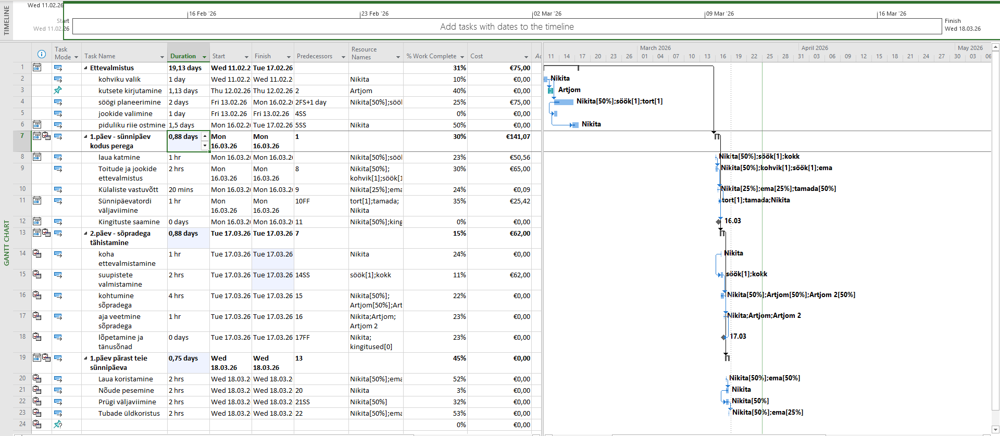

# MS Projecti Juhendmaterjalide Veebileht

See projekt on loodud õppe-eesmärgil, et selgitada Microsoft Projecti põhifunktsioone läbi veebikeskkonna.

## 📑 Sisukord
1. [Uue kalendri loomine](#index)
2. [Arvutusväljade lisamine](#valem)
3. [Diagrammide koostamine](#diagramm)

## ✨ Projekti kirjeldus
Veebileht koosneb kolmest peamisest moodulist, mis juhendavad kasutajat MS Projecti seadistamisel.
* **Autor:** Nikita Nikiforov (TARpv24)
* **Tehnoloogiad:** HTML5, CSS3

## 🖼️ Vaade projektist

