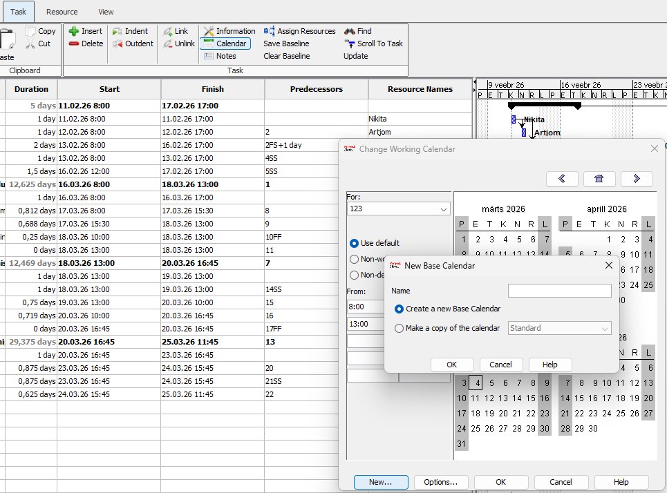

# 📊 ProjectLibre mooduli arendus

See haru keskendub vabavaralise projektijuhtimistarkvara **ProjectLibre** juhendmaterjalide loomisele ja veebilehe arendusele.

## 📑 Sisukord
1. [Tehtud tööd](#-tehtud-tööd)
2. [Muudetud failid](#-muudetud-failid)
3. [Funktsionaalsused](#-funktsionaalsused)
4. [Koodinäide](#-koodinäide)
5. [Ekraanitõmmised](#-ekraanitõmmised)

---

## ✅ Tehtud tööd
- [x] ProjectLibre kalendri seadistamise juhendi koostamine.
- [x] Võrkdiagrammi (Network Diagram) selgituste lisamine.
- [x] Ekraanitõmmiste tegemine ja optimeerimine.
- [x] HTML struktuuri ja CSS stiilide kohandamine.

## 📂 Muudetud failid

| Faili nimi | Kirjeldus |
| :--- | :--- |
| `index.html` | Kalendri seadistamise sammud ja struktuur. |
| `diagramm.html` | Diagrammide ja vaadete õpetus. |
| `style.css` | Disainielemendid, sammude numeratsioon ja pildiraamid. |

## ✨ Funktsionaalsused
Projektis lisati järgmised juhendmaterjalid ja tehnilised lahendused:
* **Kalendri haldus:** Uue kalendri loomine ja erandite (pühade) märkimine [^1].
* **Visualiseerimine:** Võrkdiagrammi abil kriitilise tee tuvastamine.
* **Navigatsioon:** Interaktiivne menüü lehtede vahel liikumiseks.

> [!TIP]
> ProjectLibre on suurepärane tasuta alternatiiv MS Projectile, kui vajate põhilisi planeerimistööriistu.

> [!WARNING]
> Kalendri muudatused mõjutavad automaatselt kogu projekti lõppkuupäeva.

---

## 💻 Koodinäide
Näide sellest, kuidas HTML-is on struktureeritud samm-sammuline juhend:

```html
<section>
  <div class="step-num">01</div>
  <div class="step-content">
    <h2>Uue kalendri loomine</h2>
    <p>Kalendri seadistamiseks vajutame ülemises menüüs nuppu <strong>Task</strong> ja seejärel valime <strong>Calendars</strong>.</p>
    <div class="img-box"></div>
  </div>
</section>
````

-----

## 🖼️ Ekraanitõmmised

Siin on näited projekti visuaalsest poolest:


-----
